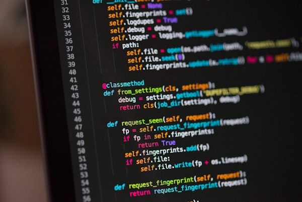

# Shell Fundamentals - To-Do List Manager

This project is a simple interactive To-Do List manager built using Bash scripting. It allows users to view, add, and delete tasks directly from the terminal.

## Features
- **View all tasks:** Displays tasks with their corresponding line numbers.
- **Add a new task:** Appends a new task to the `~/todo.txt` file.
- **Delete a task:** Removes a task by its line number using `sed`.
- **Persistent Storage:** Tasks are stored in `~/todo.txt` in the user's home directory.
- **Interactive Menu:** A user-friendly loop for continuous task management.

## Installation
1. Clone this repository or download the `todo.sh` file.
2. Make the script executable:
   ```bash
   chmod +x todo.sh
   ```

## Usage
Run the script using:
```bash
./todo.sh
```

## Screenshots and Descriptions

### 1. Main Menu
The main menu provides options to View, Add, Delete, or Exit the program.


*Description: This screenshot shows the initial menu of the To-Do List manager, where the user is prompted to choose an option.*

### 2. Adding a Task
Users can add tasks by selecting option 2 and typing the task description.


*Description: Here, the user selects option 2 and adds "Complete Bash Project" to their list. The script confirms the task was added successfully.*

### 3. Viewing Tasks
Option 1 displays all currently saved tasks with line numbers.


*Description: This screenshot displays the list of tasks. The `nl` command is used to ensure each task has a unique number.*

### 4. Deleting a Task
Option 3 allows users to delete a task by entering its number.


*Description: The user selects option 3 and enters '1' to delete the first task. The script uses `sed -i` to remove the specific line from the file.*

### 5. Exiting the Program
Option 4 terminates the script.


*Description: The user selects option 4 to exit the loop and close the program.*

---
*Note: The images above are placeholders. In a real-world scenario, actual screenshots of the terminal would be uploaded here.*
